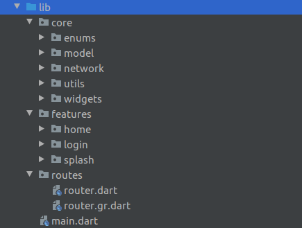

[](https://github.com/Shadow60539/bookshelf)

# Introduction

> “Bookshelf”
is a small, simple and beautiful app,
read books like never before at free of cost.

Before we start, you can take a look at the app:


## Key Features

- [x] Read, Wishlist and Mark as read.
- [x] Secured authentication.
- [x] What else.


## How To Use

To clone and run this application, you'll need [Git](https://git-scm.com) and [Flutter](https://flutter.dev/docs/get-started/install) installed on your computer. From your command line:

```bash
# Clone this repository
$ git clone https://github.com/Shadow60539/bookshelf.git

# Go into the repository
$ cd bookshelf.git

# Install dependencies
$ flutter packages get

# Run the app
$ flutter run
```


### Packages


Some very good packages are used in the project, not a big list.


Below are the information about these packages.


package | explain
---|---
[auto_route](https://pub.flutter-io.cn/packages/auto_route) | navigations
[firebase_core](https://pub.flutter-io.cn/packages/firebase_core) | core package for firebase apps
[firebase_auth](https://pub.flutter-io.cn/packages/firebase_auth) | firebase authentication
[cloud_firestore](https://pub.flutter-io.cn/packages/cloud_firestore) | firestore database
[flutter_staggered_grid_view](https://pub.flutter-io.cn/packages/image_crop) | more custom grids
[font_awesome_flutter](https://pub.flutter-io.cn/packages/font_awesome_flutter) | awesome icons
[http](https://pub.flutter-io.cn/packages/table_calendar) | network
[flutter_svg](https://pub.flutter-io.cn/packages/date_format) | load svg images
[dio](https://pub.flutter-io.cn/packages/audioplayers) | http client for Dart, which supports Interceptors
[dio_http_cache](https://pub.flutter-io.cn/packages/flutter_local_notifications) | cache dio response
[auto_route_generator](https://pub.flutter-io.cn/packages/hive_generator) | navigations generator
[build_runner](https://pub.flutter-io.cn/packages/build_runner) | to build custom models

### Directory Structure

The project directory structure is as follows:

```
├── android
├── assets
├── fonts
├── build
├── images
├── ios
├── lib
├── pubspec.lock
├── pubspec.yaml

```


Let me explain the other directories besides **lib**:

directory | explain
---|---
images | readme images files
fonts | custom fonts
assets | images files

Then the lib directory





directory | explain
---|---
core | Core layer
features | auth ,login ,home
routes | auto_route files


